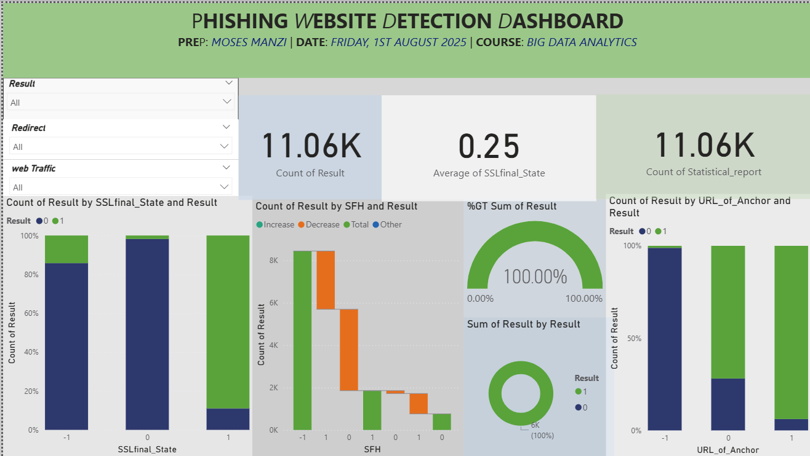

### Project Title:

**Phishing Website Detection using Machine Learning and Power BI**

---

### Project Overview

This project aims to detect phishing websites using a Random Forest machine learning model. The dataset is cleaned, analyzed, and visualized using Python and Power BI to offer both technical insights and an interactive dashboard.

---

### Tools and Technologies
* # *Anaconda* including:
* Python (Jupyter Notebook)
* scikit-learn
* pandas, seaborn, matplotlib
* Microsoft PowerBI

---

### Dataset

**UCI Phishing Websites Dataset**

* Source: UCI Machine Learning Repository(https://archive.ics.uci.edu/dataset/333/phishing+websites)
* Format: `.arff`
* Records: 11,055
* Features: 30 (including `Result` label: 1 = legitimate, 0 = phishing)

---

### Step-by-Step Process

#### 1. Dataset Import and Conversion

* Loaded `.arff` file using `scipy.io.arff`.
* Converted it into a pandas DataFrame.
* Saved the cleaned dataset as `phishing_dataset.csv` for Power BI use.

#### 2. Data Cleaning

* Decoded byte-encoded object fields.
* Checked for missing values (none found).
* Converted target `Result` field to binary format.

#### 3. Exploratory Data Analysis (EDA)

* Analyzed class distribution.
* Visualized important features using:

  * Pairplots (`seaborn`)
  * Histograms
  * Correlation heatmap

#### 4. Machine Learning: Random Forest Model

* Split data (70% training, 30% testing).
* Trained a Random Forest Classifier.
* Achieved **96.68% accuracy** on test set.

#### 5. Power BI Dashboard

* Imported `phishing_dataset.csv`.
* Visuals created:

  * Donut chart: Distribution of results
  * Stacked column charts: Key features vs. results
  * Gauge chart: % of legitimate vs. phishing
  * Waterfall chart: `SFH` feature impact
  * Card: Total number of records

### Final Dashboard

*Add a full screenshot of your final Power BI dashboard here.*

### Preped by:

**Moses Manzi**

# Instructor: Eric Maniraguha
# Course: Introduction to Big Data Analytics 

**August 2025**
